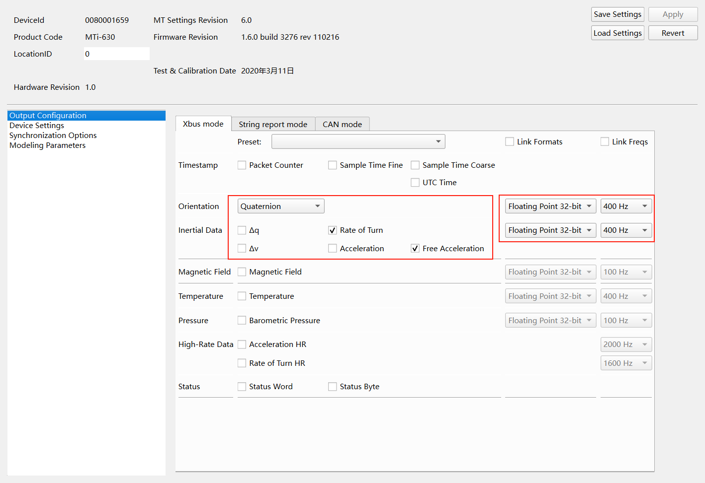
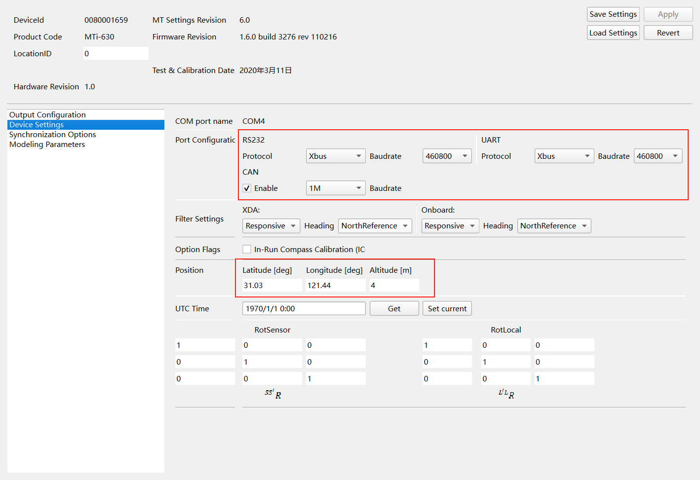
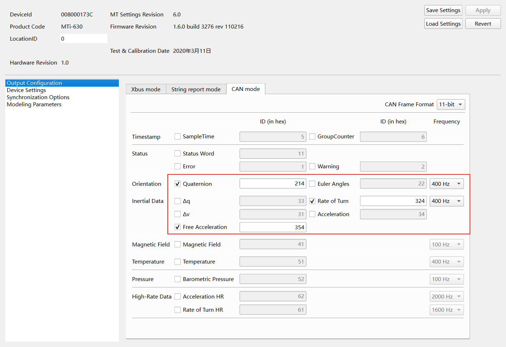

# XsensMTi600-IMU

1. 该说明主要针对Windows平台
2. IMU安装后注意用Magnetic Field Mapper进行磁校准

## 使用MT Manager

从官网下载 [MT Software| Movella.com](https://www.movella.com/support/software-documentation) 后参考官方文档 [MT Manager用户手册 | movella.com](https://mtidocs.movella.com/zh-cn/mt-manager)

## 基于MT SDK二次开发

从官网下载 [MT Software| Movella.com](https://www.movella.com/support/software-documentation) 安装目录.\MT SDK.\Examples路径下有 Cpp|Visual Studio (xda_public_cpp) 例程和 Matlab (xda_matlab) 例程，具体说明可以参考Software路径下的Doc

## Simulink Serial

利用MT Manager进行如下设置（也可以利用MT SDK或串口通信设置，可参考官方文档此处略）

运行.\src\Serial\init.m进入测量模式，并通过程序输出观察Data Size等信息，如果DisableAutoMeasurement的flag为空（上电即进入测量模式）且熟悉消息详细定义则不需要该步骤。

接下来给出消息详细定义，建议结合官方文档食用。这里红色方框是Headers，包含Preamble(250/0xFA)，BID(255/0xFF)和MID；黄色方框是DATA长度，这里样例消息Quaternion+Acceleration+Rate of Turn长度是49；红色下划线是Quaternion消息，黄色下划线是Acceleration消息，蓝色下划线是Rate of Turn消息；绿色方框是消息对应的MID，紫色方框是消息数据长度，整个packet末尾的绿色方框是checksum。

.png)

进入测量模式后打开.\src\Serial\Serial_receiver.slx配置运行即可，注意Serial Receive中的Data size应为前一步Data长度+1，具体原因参见parseXsensData函数。

## Simulink CAN

此处是一个使用Kvaser Leaf Light v2的样例（其它CAN卡可以参考）

首先从官网下载并安装 [Downloads - Kvaser Drivers](https://kvaser.com/download/)，再安装Matlab附加功能 Use Kvaser CAN hardware with MATLAB-Code Example。

注意CAN通讯需要IMU自动进入测量模式，因此先用MT Manager配置输出（串口配置也可以），参考[通过 MT Manager 启用 CAN (movella.com)](https://mtidocs.movella.com/zh-cn/enabling-can-through-mt-manager)

由于CAN通讯是利用ID区分设备及消息，因此多个IMU接入时应当加以区分，这里给出一个样例是在默认ID后加入设备编号，注意MT Manager中的ID为十六进制，而Simulink中为十进制。

|       Data        | ID (in hex) |
| :---------------: | :---------: |
|    Quaternion     |     21i     |
|   Rate of Turn    |     32i     |
|      delta v      |     31      |
| Free Acceleration |     35i     |

配置输出完成后打开.\src\Serial\CAN_receiver.slx设置波特率，采样时间（对应消息频率），消息ID和消息格式，这里message ID格式 $529=2*16^2+1*16+1$，表示第一个IMU设备的四元数数据。

如果存在问题也可以先用Matlab的Vehicle Network Toolbox测试消息是否正常接收，验证驱动安装等前置步骤
